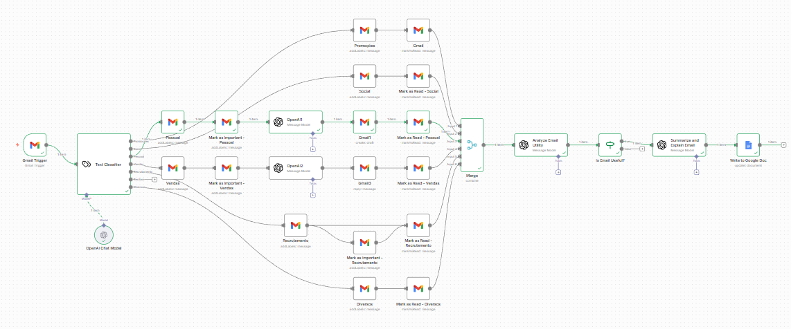

# SmartMail-n8n-AI 

An intelligent email automation system built with **n8n**, **OpenAI (GPT-4o-mini)**, and **Google Workspace**. This project automatically classifies, labels, summarizes, and drafts replies for your incoming Gmail messages, ensuring your inbox stays organized and important information is never missed.

## Features

- **Automated Classification**: Uses AI to categorize emails into:
  - Promotions
  - Social
  - Personal
  - Sales
  - Recruitment
  - Receipts
  - Miscellaneous
- **Smart Labeling**: Automatically applies labels in Gmail based on classification.
- **Priority Detection**: Identifies useful/important emails and marks them as `IMPORTANT`.
- **AI-Powered Summaries**: Generates concise summaries of important emails and explains their significance.
- **Google Docs Integration**: Logs summaries of important emails directly into a Google Doc for easy tracking.
- **Draft Responses**: Automatically creates draft replies for personal and sales inquiries.
- **Clean Inbox**: Automatically marks non-essential emails (like Social or Promotions) as read.

## Workflow Preview

## Demonstration

Watch the automation in action:

<video src="testando_automacao.mp4" controls title="Automation Demo" style="max-width: 100%;"></video>

*(Note: If the video doesn't load automatically, you can also view it directly [here](testando_automacao.mp4))*

## How to Use

### Prerequisites
- An **n8n** instance (cloud or self-hosted).
- **OpenAI API Key** (for classification and summarization).
- **Google Cloud Credentials** (with Gmail and Google Docs APIs enabled).

### Installation Steps
1. **Import the Workflow**:
   - Download the `workflow_codigo.json` file from this repository.
   - In your n8n dashboard, click on the **Workflows** tab and select **Import from File**.
   - Select `workflow_codigo.json`.
2. **Setup Credentials**:
   - Configure your **Gmail OAuth2** credentials in n8n.
   - Configure your **OpenAI API** credentials.
   - Configure your **Google Docs OAuth2** credentials.
3. **Configure the Google Doc**:
   - Open the `Write to Google Doc` node.
   - Replace the `Document URL` with your own Google Doc URL.
4. **Activate**:
   - Turn on the workflow. It is set to check for new unread emails every 5 minutes by default.

## Automation JSON

The full workflow configuration is available in the [workflow_codigo.json](workflow_codigo.json) file.

---
*Created by Kayke*
